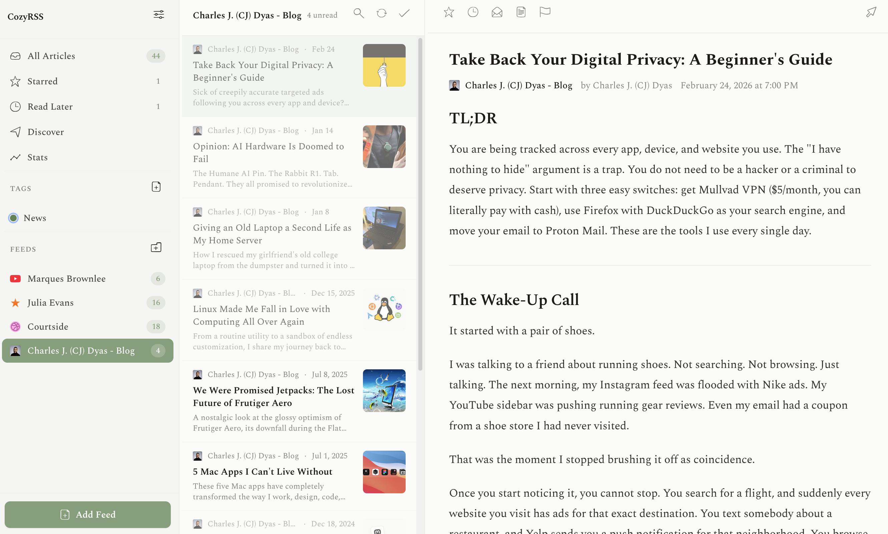
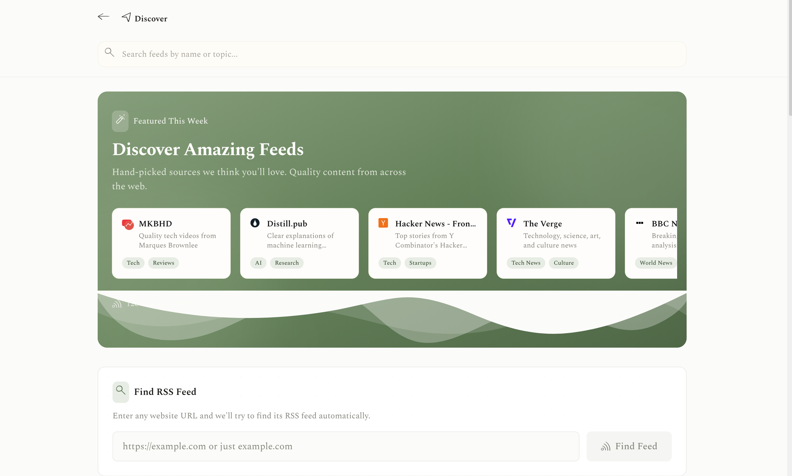
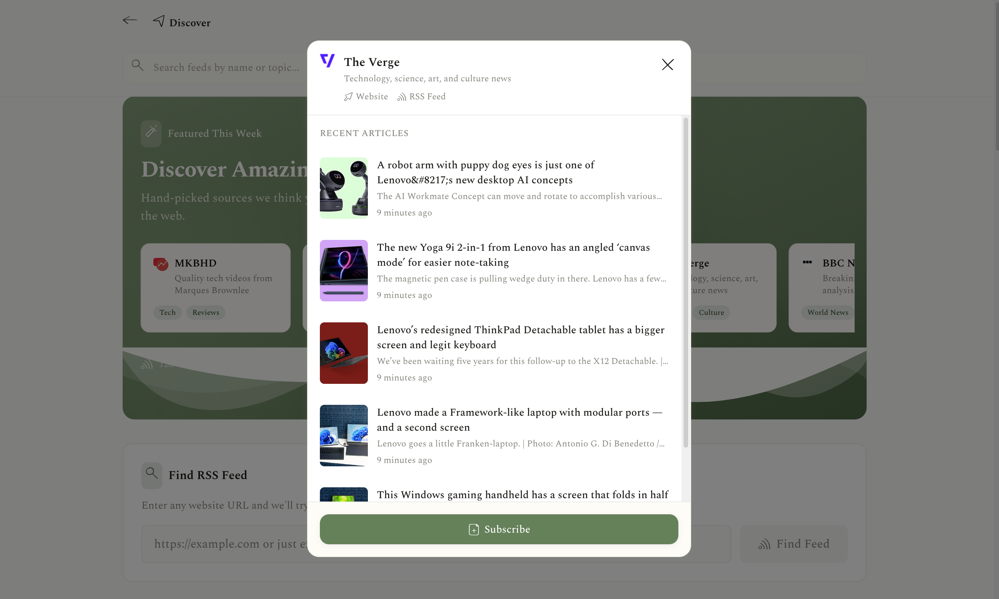
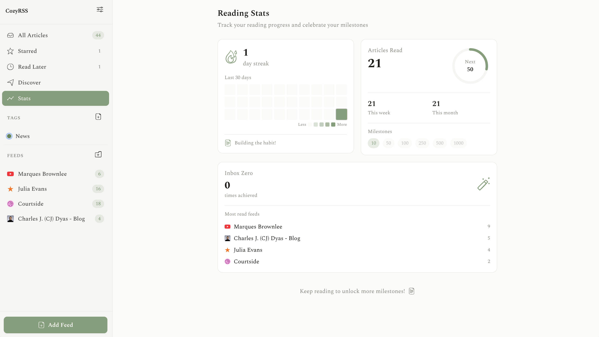

# CozyRSS

A calm, focused RSS reader for your home server. No ads. No algorithms. No cloud dependencies. Just you and the content you choose.



## Features

### Read on your terms
Subscribe to RSS, Atom, and JSON feeds from your favorite sites. Articles are displayed in a clean three-column layout with reader mode for distraction-free reading.

### Discover new content
Find new feeds with curated recommendations and automatic feed detection. Just paste a website URL and CozyRSS will find its feed.



### Preview before you subscribe
See recent articles and feed details before committing. One click to subscribe.



### Track your reading
Reading stats, streaks, and milestones keep you motivated. See your most-read feeds and celebrate your progress.



### And more
- Organize feeds with folders and tags
- OPML import/export
- Dark mode and customizable themes
- Keyboard shortcuts
- Mobile-friendly responsive design

## Quick Start with Docker

### Using Docker Compose (recommended)

```bash
git clone https://github.com/dyascj/cozy-rss.git
cd cozy-rss
SESSION_SECRET=$(openssl rand -hex 32) docker compose up -d
```

Open `http://localhost:3000` and create your account.

### Using the pre-built image

```yaml
# docker-compose.yml
services:
  cozyrss:
    image: ghcr.io/dyascj/cozyrss:latest
    ports:
      - "3000:3000"
    volumes:
      - cozyrss-data:/app/data
    environment:
      - SESSION_SECRET=your-secret-here-use-openssl-rand-hex-32
    restart: unless-stopped

volumes:
  cozyrss-data:
```

```bash
docker compose up -d
```

## Configuration

| Variable | Required | Default | Description |
|----------|----------|---------|-------------|
| `SESSION_SECRET` | Yes | -- | Secret for signing session cookies. Generate with `openssl rand -hex 32` |
| `DATABASE_PATH` | No | `/app/data/cozyrss.db` | Path to SQLite database file |
| `PORT` | No | `3000` | Server port |

## Development

```bash
# Install dependencies
npm install

# Create environment file
cp .env.example .env
# Edit .env and set SESSION_SECRET

# Run development server
npm run dev
```

## Data

All data is stored in a single SQLite database file. Back it up by copying the file:

```bash
# If using Docker volumes
docker cp $(docker compose ps -q cozyrss):/app/data/cozyrss.db ./backup.db
```

## OPML Import/Export

You can import feeds from other RSS readers via OPML:
- **Import:** Settings > Import OPML
- **Export:** Settings > Export OPML

## Tech Stack

- [Next.js](https://nextjs.org/) -- Full-stack React framework
- [Drizzle ORM](https://orm.drizzle.team/) -- Type-safe database access
- [SQLite](https://sqlite.org/) -- Embedded database
- [Tailwind CSS](https://tailwindcss.com/) -- Styling
- [Zustand](https://zustand-demo.pmnd.rs/) -- State management

## License

MIT
